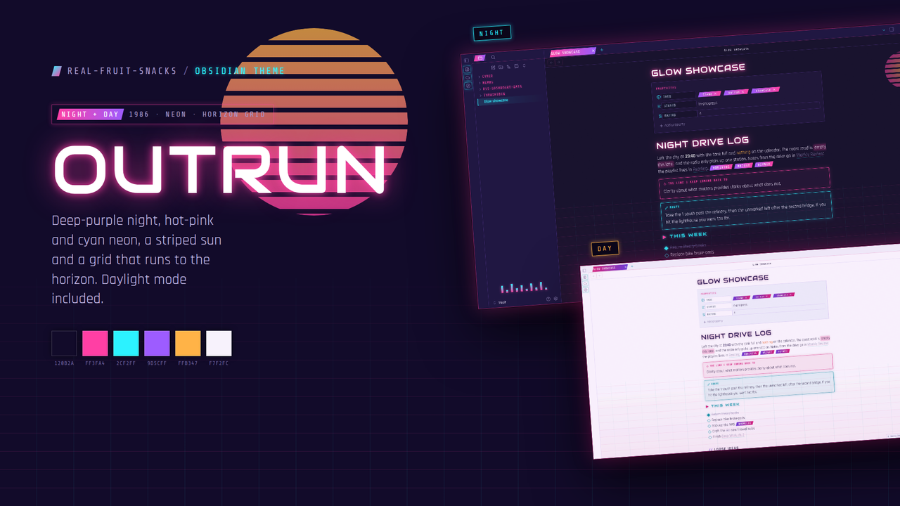
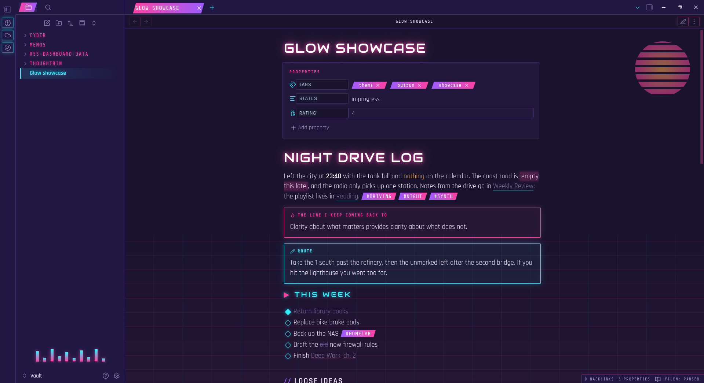
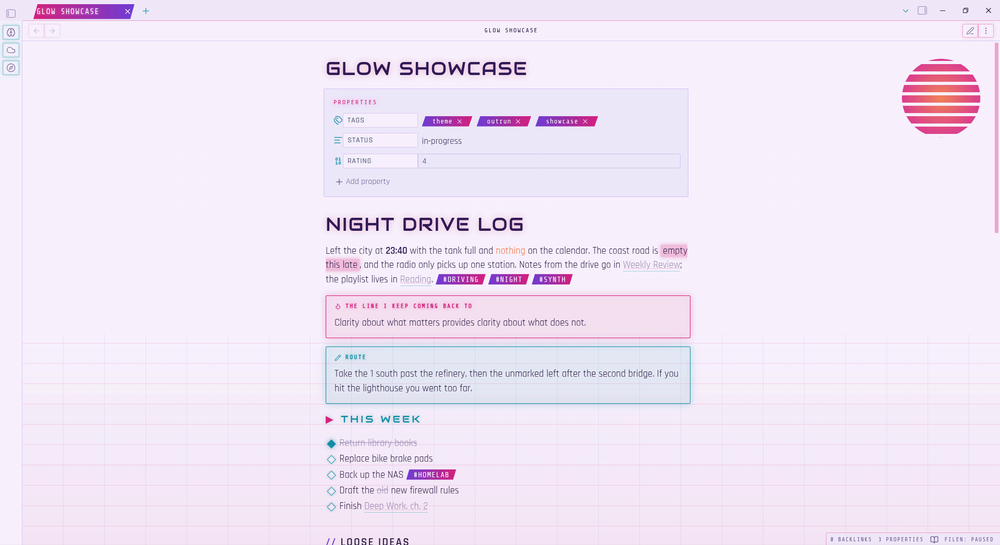

  

# Outrun

1986. A deep-purple night, hot-pink and cyan neon, a striped sun in the corner and a grid that runs to the horizon. Outrun goes all in — and comes with a daylight mode for when the sun's actually up.

## What it does

- Glowing Audiowide headings; Rajdhani body text; Share Tech Mono for code, tabs and labels (all embedded, nothing to install)
- A striped sunset and a horizon grid painted behind every note
- Gradient clip-path tabs and tags, diamond checkboxes, neon-edged callouts with a glowing mono title in a colour per type
- CRT-black code blocks with a cyan edge and a full syntax palette
- Animated equaliser under the file explorer
- Settings, modals, command palette, menus, properties, hover previews, graph and mobile toolbars all styled to match
- Accent set through Obsidian's own variables, so plugins pick it up automatically

  

  

## Install

**From the community list** — Settings → Appearance → Themes → Manage → search "Outrun".

**Manually**

1. Download `theme.css` and `manifest.json` from the [latest release](https://github.com/Real-Fruit-Snacks/obsidian-outrun/releases/latest).
2. Put them in `<your vault>/.obsidian/themes/Outrun/`.
3. Settings → Appearance → Themes → Outrun.

Tip: turn on **Readable line length** (Settings → Editor). The theme is designed around it — the note sits centred and the sun and grid live in the space around it.

## Night and day

Outrun follows Obsidian's base colour scheme. **Dark** is the neon night; **Light** is the same world at noon — pale lavender sky, the same sun, accents deepened so they read on white. Code blocks stay as dark screens in both.

| Role | Night | Day |
|---|---|---|
| Background | `#120B2A` / `#1A1040` | `#F7F2FC` / `#EFE7F8` |
| Pink | `#FF3FA4` | `#D61A7C` |
| Cyan | `#2CF2FF` | `#0A8FA6` |
| Purple | `#9D5CFF` | `#6E3AD6` |
| Sun | `#FFB347` | `#EF6F3A` |
| Text | `#F3EAFF` / `#A99BD1` | `#23133F` / `#6B5B90` |

## Contributing

Issues and pull requests welcome. No build step: edit `theme.css`, reload Obsidian. For development the fonts can be split into a CSS snippet so the theme file stays readable — see `dev/` in the repo.

## License

MIT. Fonts are under the SIL Open Font License.
